# 🎵 Moodify - Your Personal Music Sanctuary


A beautiful anime-inspired music streaming application that curates playlists based on your emotional state, featuring complete anonymous identity system, real-time collaborative listening, and privacy-first social features. Built with modern web technologies and designed for seamless music discovery without compromising user privacy.

## Project Overview

**Moodify** is a modern, privacy-focused music streaming platform that combines mood-based playlist curation with social features—all without requiring user accounts or tracking. The application leverages client-side technologies to provide a rich, interactive experience while maintaining complete user anonymity and data privacy.

**Key Architecture Principles:**

- **Zero-backend identity system**: All user identities stored locally in browser localStorage
- **Client-side cryptography**: Deterministic avatar generation and identity management in browser
- **Peer-to-peer communication**: Direct WebRTC connections for collaborative listening
- **No data persistence**: No user data stored on servers, complete privacy
- **Progressive Web App**: Installable on any device with offline capabilities
- **Mood-reactive UI**: Dynamic interface that responds to user's emotional state

The application features a unique 6-mood system (Chill, Focus, Party, Workout, Love, Melancholy) and generates deterministic avatars for anonymous user identification, enabling social features without compromising privacy.

## Privacy and Anonymous Identity System

### End-to-End Privacy

- **Anonymous Identity**: UUID v4-based unique identifiers with no personal information
- **Client-Side Storage**: All identity data stored exclusively in browser localStorage
- **Deterministic Avatars**: Beautiful SVG identicons generated from seed strings
- **Zero Tracking**: No analytics, no cookies, no user behavior monitoring

### Identity Management Security

- **Local Identity Storage**: Private keys and user data never leave the device
- **Recovery Code System**: Base58-encoded backup codes with checksums
- **Passphrase-Free**: No passwords required, pure client-side identity
- **Cross-Device Sync**: Optional identity export/import for multiple devices
- **Instant Deletion**: Complete identity reset with single click

### Operational Privacy

- **No Registration**: Immediate access without account creation
- **Temporary Sessions**: Session-based connections with no persistent tracking
- **P2P Communication**: Direct peer connections bypass server for content
- **Minimal Metadata**: Only essential routing information processed
- **Memory Protection**: Sensitive data cleared after use

## Features and Capabilities

### Core Music Features

- **Mood-Based Playlists**: 6 curated mood categories with dynamic content
- **Full-Featured Player**: Play, pause, skip, shuffle, repeat, volume control
- **Queue Management**: Add, remove, reorder tracks in playback queue
- **Playlist Creation**: Build and save unlimited custom playlists
- **Favorites System**: Heart your favorite tracks for quick access
- **Listening History**: Track your music journey with playback history
- **Search Integration**: JioSaavn API integration for extensive music library
- **Crossfade Support**: Smooth transitions between tracks

### Anonymous Identity System

- **UUID v4 Generation**: Cryptographically secure unique identifiers
- **Deterministic Avatars**: Beautiful 5x5 grid identicons with gradients
- **Display Names**: Custom nicknames (up to 20 characters)
- **Recovery Codes**: Base58-encoded export/import for identity backup
- **Identity Settings**: Complete management interface (edit, export, import, reset)
- **Onboarding Flow**: Beautiful glassmorphism modal for first-time users
- **Suggested Nicknames**: Random cool name generation (e.g., "CoolMelody42")

### Real-Time Collaborative Features

- **Listen Together**: Synchronous music playback with friends
- **Room System**: Create or join rooms with 6-character codes
- **Live Chat**: Real-time messaging with identity avatars
- **Guest Management**: Host controls for up to 10 guests
- **Live Streaming**: Broadcast YouTube/Twitch streams to room
- **Sync Controls**: Automatic playback synchronization
- **Heartbeat System**: Connection health monitoring
- **P2P Architecture**: Direct WebRTC connections via PeerJS

### Social Discovery (Anonymous)

- **Community Playlists**: Discover music shared by other users
- **Trending Content**: See what's popular in the community
- **Live Sessions**: Join active listening rooms
- **Recent Connections**: View past listening partners
- **Playlist Sharing**: Share playlists with generated codes
- **Like System**: Support creators without revealing identity
- **QR Code Sharing**: Quick mobile playlist sharing

### Technical Advantages

- **Zero Backend for Identity**: Complete client-side implementation
- **Fast Performance**: React 18 with optimized rendering
- **Responsive Design**: Mobile-first, works on all screen sizes
- **PWA Support**: Installable as native app
- **Offline Capable**: Service worker for offline functionality
- **Type Safety**: Full TypeScript implementation
- **Modern UI**: Glassmorphism with purple-pink gradients
- **Accessibility**: ARIA labels, keyboard navigation

### Unique Selling Points

- **No Account Required**: Start listening immediately
- **Complete Anonymity**: No email, no phone, no OAuth
- **Privacy First**: Zero data collection or tracking
- **Beautiful Design**: Anime-inspired with floating particles
- **Social Without Surveillance**: Connect without compromising privacy
- **Self-Contained**: No external dependencies for core features
- **Open Source**: Full transparency, community-driven

## Installation Instructions

### Prerequisites

- Node.js 18+ (LTS recommended)
- npm 9+ or yarn 1.22+
- Modern web browser (Chrome, Firefox, Safari, Edge)
- Internet connection for initial setup

### Quick Start (Development)

1. **Clone the repository**:
   ```bash
   git clone https://github.com/khageshpatil/Moodify.git
   cd Moodify
   ```

2. **Install dependencies**:
   ```bash
   npm install
   # or
   yarn install
   ```

3. **Start development server**:
   ```bash
   npm run dev
   # or
   yarn dev
   ```

4. **Open your browser**:
   Navigate to `http://localhost:8080`

### Production Build

Build the application for production deployment:

```bash
# Create optimized production build
npm run build

# Preview production build locally
npm run preview
```

The build output will be in the `dist/` directory.

### Deployment Options

#### GitHub Pages (Recommended)

This project includes automated GitHub Pages deployment:

1. **Fork or clone** the repository to your GitHub account

2. **Enable GitHub Pages**:
   - Go to repository Settings → Pages
   - Source: GitHub Actions
   - Branch will be set automatically

3. **Push to main branch**:
   ```bash
   git push origin main
   ```

4. **Access your site**:
   `https://[your-username].github.io/Moodify/`

#### Manual Deployment

Deploy the `dist/` folder to any static hosting:

**Netlify:**
```bash
npm install -g netlify-cli
npm run build
netlify deploy --prod --dir=dist
```

**Vercel:**
```bash
npm install -g vercel
npm run build
vercel --prod
```

**Custom Server (Nginx):**
```nginx
server {
    listen 80;
    server_name your-domain.com;
    root /path/to/Moodify/dist;
    
    location / {
        try_files $uri $uri/ /index.html;
    }
}
```

### Environment Configuration

No environment variables required! Moodify works completely client-side.

Optional customization via `vite.config.ts`:
```typescript
export default defineConfig({
  base: '/Moodify/', // Base path for GitHub Pages
  server: {
    port: 8080, // Development port
  },
});
```

## Architecture and Data Flow

### Application Architecture

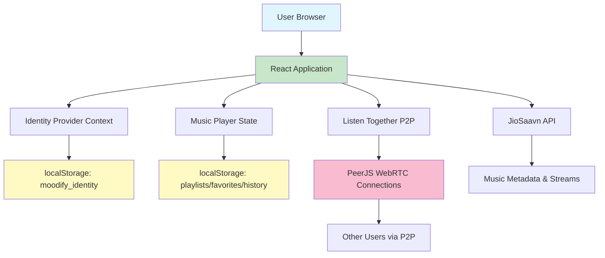

### Identity System Workflow

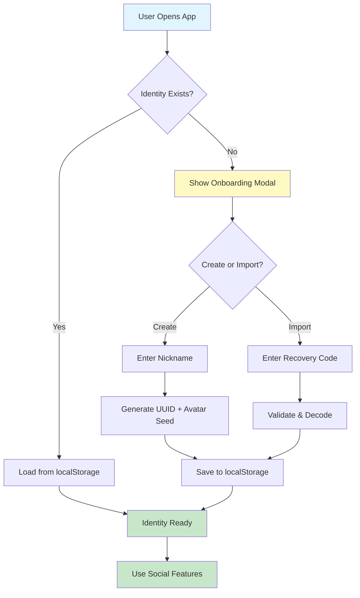

### Listen Together Communication Flow

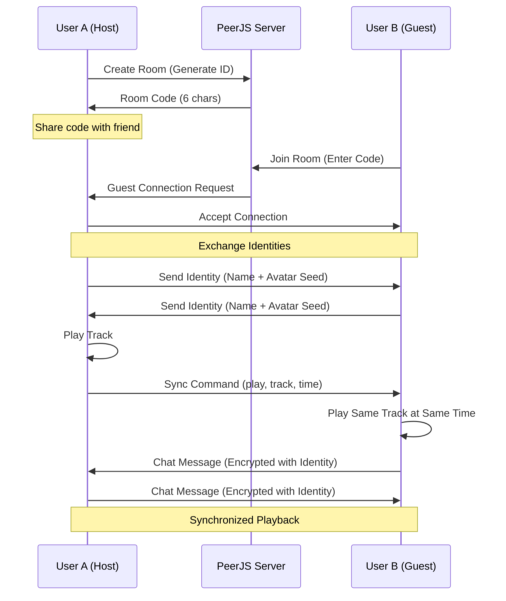

### Data Storage Model

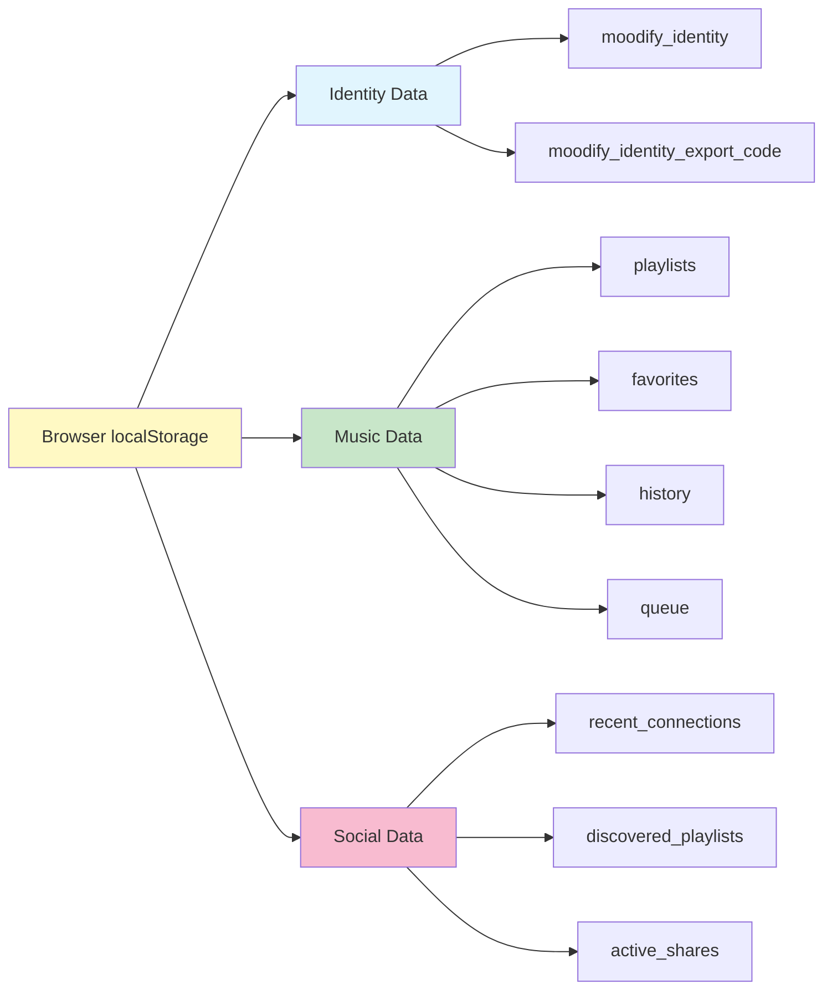

## Usage Guide

### Initial Setup and Onboarding

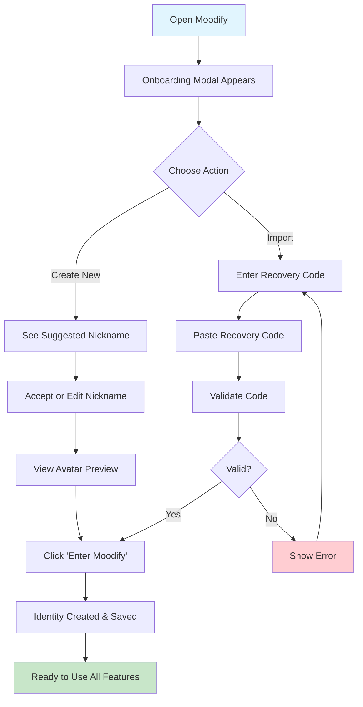

### Creating and Managing Identity

#### First Time Setup

1. **Open the application** in your web browser
2. **Onboarding modal appears** automatically
3. **Choose a nickname**:
   - Use the suggested name (e.g., "CoolMelody42")
   - Click refresh icon for new suggestions
   - Or type your own (up to 20 characters)
4. **View your avatar** - generated automatically from your name
5. **Click "Enter Moodify"** - identity is created and saved
6. **Export your identity** (recommended):
   - Click your name in top navigation
   - Click "Export Identity"
   - Save the recovery code securely

#### Identity Management

Access identity settings by clicking your name button:

- **Edit Name**: Change your display name anytime
- **Export**: Generate recovery code for backup
- **Import**: Restore identity from recovery code
- **Reset**: Clear identity and start fresh

### Music Discovery and Playback

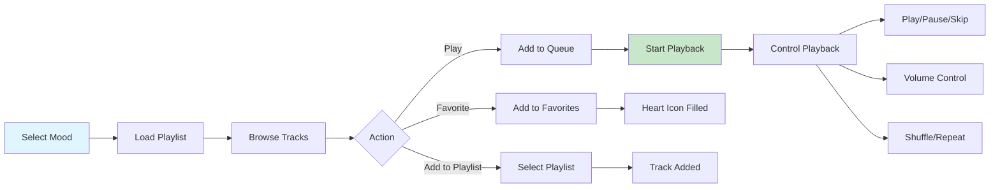

#### Step-by-Step Music Experience

1. **Choose Your Mood**:
   - Select from: Chill, Focus, Party, Workout, Love, Melancholy
   - Each mood has curated playlists

2. **Browse and Play**:
   - Click any track to play immediately
   - View track details, artist, album
   - Add to favorites with heart icon

3. **Manage Playlists**:
   - Create new playlists
   - Add tracks from any mood
   - Rename or delete playlists
   - Export/import as JSON

4. **Use Player Controls**:
   - Play/Pause, Previous, Next
   - Seek through track timeline
   - Adjust volume and mute
   - Enable shuffle or repeat modes

### Collaborative Listening Experience

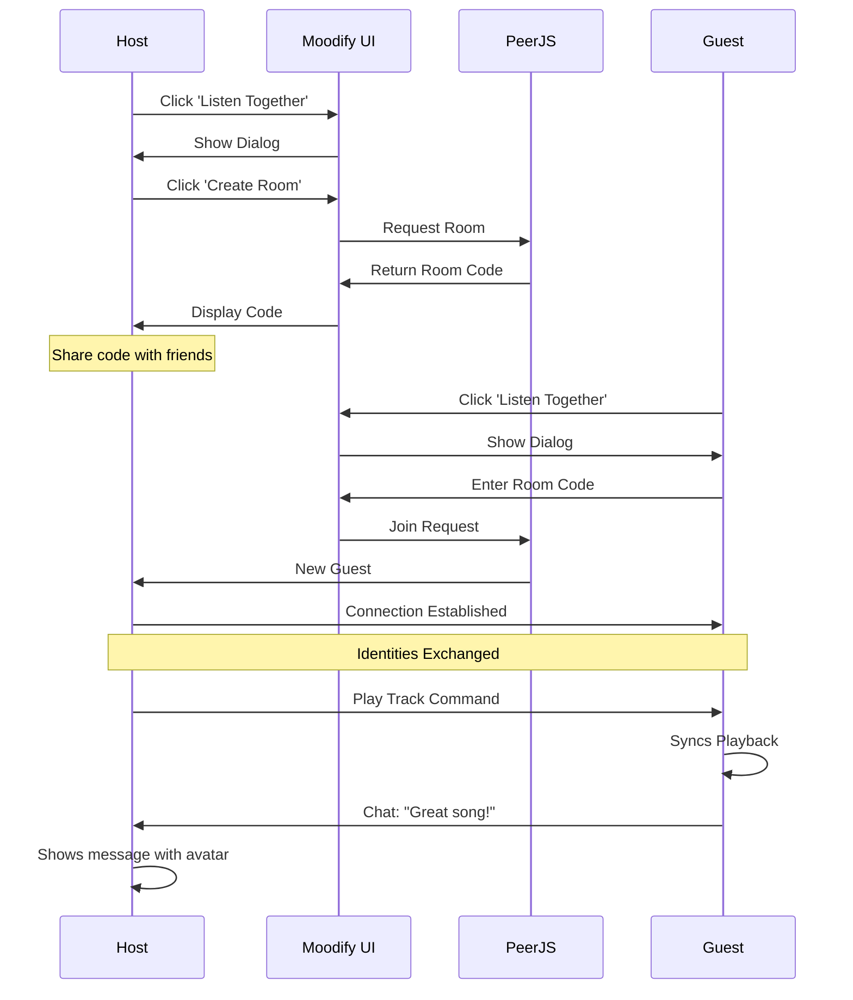

#### Listen Together Guide

**As Host (Creating Room):**

1. Click **"Listen Together"** button in navigation
2. Click **"Create Room"** in dialog
3. **Share the 6-character code** with friends
4. **Wait for guests** to join (see them appear in user list)
5. **Play music** - it syncs automatically to all guests
6. **Chat with guests** - your identity and avatar appear
7. **Control playback** for everyone
8. Optional: **Start live stream** from YouTube/Twitch

**As Guest (Joining Room):**

1. Get **room code** from host
2. Click **"Listen Together"** button
3. Click **"Join Room"**
4. **Enter the code** and click Join
5. **Connected!** Your identity sent to host
6. **Listen in sync** with host's playback
7. **Chat with everyone** in the room
8. Optional: **Enable live mode** to broadcast your audio

### Social Features Workflow

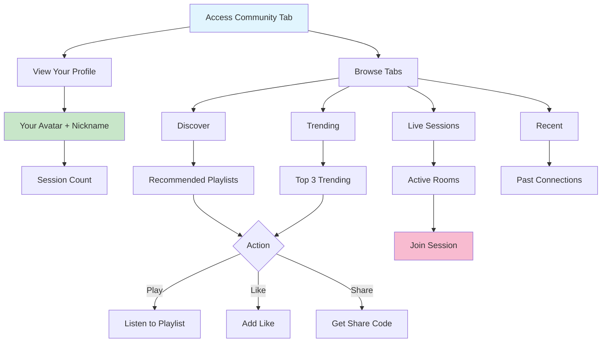

#### Community Discovery

1. **Navigate to Community**:
   - Click "Community" in navigation
   - See your anonymous profile at top

2. **Discover Tab**:
   - View personalized recommendations
   - See how anonymous discovery works
   - Browse your past discoveries

3. **Trending Tab**:
   - See top 3 trending playlists
   - View likes and access counts
   - Play or like trending content

4. **Live Sessions Tab**:
   - Browse active listening rooms
   - See participant counts
   - Join public sessions
   - Create your own session

5. **Recent Tab**:
   - View recent listening partners
   - See connection history
   - Reconnect with past users

### Advanced Features

#### Playlist Sharing

1. Create or select a playlist
2. Click **"Export"** button
3. Choose sharing options:
   - **Public**: Anyone with code can access
   - **Password Protected**: Requires password
   - **Expiring**: Set expiration time
4. Share the generated code
5. Others import using **"Import Playlist"**

#### Identity Export/Import

**Export Process:**
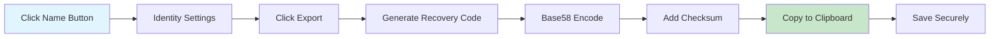

**Import Process:**
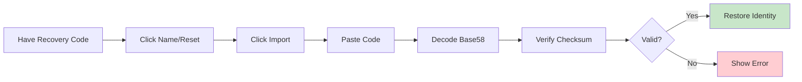

## Technical Stack and Architecture

### Frontend Technologies

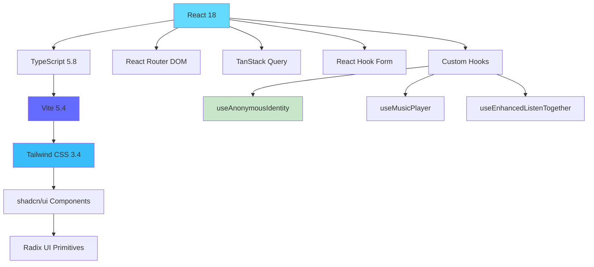

### Core Dependencies

**Build & Development:**
- React 18.3.1 - UI library
- TypeScript 5.8.3 - Type safety
- Vite 5.4.19 - Build tool & dev server
- ESLint 9.32 - Code linting

**UI & Styling:**
- Tailwind CSS 3.4.17 - Utility-first CSS
- shadcn/ui - Component library
- Radix UI - Accessible primitives
- Lucide React 0.462 - Icon library
- Tailwind Animate - Animation utilities

**State & Data:**
- TanStack Query 5.83 - Data fetching
- React Hook Form 7.61 - Form management
- Zod 3.25 - Schema validation

**Real-Time & P2P:**
- PeerJS 1.5.5 - WebRTC wrapper
- WebSocket - Native browser API

**Routing & Navigation:**
- React Router DOM 6.30 - Client-side routing

### Project Structure

```
Moodify/
├── public/                      # Static assets
│   ├── favicon.svg             # Main favicon
│   ├── apple-touch-icon.svg    # iOS icon
│   ├── site.webmanifest        # PWA manifest
│   └── robots.txt              # SEO configuration
│
├── src/
│   ├── components/             # React components
│   │   ├── identity/          # Identity system
│   │   │   ├── IdentityProvider.tsx
│   │   │   ├── IdentityOnboardingModal.tsx
│   │   │   ├── IdentityAvatar.tsx
│   │   │   ├── IdentitySettings.tsx
│   │   │   └── index.ts
│   │   │
│   │   ├── ui/                # shadcn/ui components
│   │   │   ├── button.tsx
│   │   │   ├── dialog.tsx
│   │   │   ├── input.tsx
│   │   │   └── ...
│   │   │
│   │   ├── MoodTiles.tsx      # Mood selection
│   │   ├── EnhancedMusicPlayer.tsx
│   │   ├── PlaylistManager.tsx
│   │   ├── EnhancedListenTogetherDialog.tsx
│   │   ├── LocalSocialDiscovery.tsx
│   │   └── ...
│   │
│   ├── hooks/                 # Custom React hooks
│   │   ├── useAnonymousIdentity.ts
│   │   ├── useMusicPlayer.ts
│   │   ├── useEnhancedListenTogether.ts
│   │   ├── usePlaylistSharing.ts
│   │   ├── __tests__/        # Hook tests
│   │   └── ...
│   │
│   ├── pages/                 # Route pages
│   │   ├── Index.tsx         # Main app page
│   │   └── NotFound.tsx      # 404 page
│   │
│   ├── services/             # API services
│   │   └── jiosaavn.ts       # Music API
│   │
│   ├── data/                 # Mock data & types
│   │   └── mockMusic.ts
│   │
│   ├── lib/                  # Utilities
│   │   └── utils.ts
│   │
│   ├── App.tsx               # Root component
│   ├── main.tsx              # Entry point
│   └── index.css             # Global styles
│
├── .github/
│   └── workflows/
│       └── deploy.yml        # GitHub Actions
│
├── IDENTITY_SYSTEM_README.md     # Identity docs
├── IDENTITY_QUICK_START.md       # Quick guide
├── IDENTITY_IMPLEMENTATION_SUMMARY.md
├── vite.config.ts            # Vite configuration
├── tailwind.config.ts        # Tailwind config
├── tsconfig.json             # TypeScript config
└── package.json              # Dependencies
```

### Key Features Implementation

**Identity System (`src/hooks/useAnonymousIdentity.ts`):**
- 372 lines of pure TypeScript
- UUID v4 generation
- Base58 encoding/decoding
- Checksum validation
- localStorage persistence
- Export/import functionality

**Avatar Generation (`src/components/identity/IdentityAvatar.tsx`):**
- Deterministic SVG generation
- 5x5 grid pattern (mirrored)
- Purple-pink color spectrum
- Glow effects with SVG filters
- Scalable to any size

**Listen Together (`src/hooks/useEnhancedListenTogether.ts`):**
- PeerJS WebRTC connections
- Room creation and joining
- Heartbeat system (30s interval)
- Message routing
- Identity broadcasting
- Live streaming support

### Performance Optimizations

- **Code Splitting**: Dynamic imports for routes
- **Lazy Loading**: Components loaded on demand
- **Memoization**: React.memo and useMemo
- **Virtual Scrolling**: For large playlists
- **Asset Optimization**: SVG icons, optimized images
- **Bundle Size**: Tree-shaking unused code

### Browser Compatibility

- Chrome 90+ ✅
- Firefox 88+ ✅
- Safari 14+ ✅
- Edge 90+ ✅
- Mobile browsers (iOS Safari, Chrome Mobile) ✅

## Contributing

Contributions are welcome! This project follows standard open-source practices.

### How to Contribute

1. **Fork the repository**
2. **Create a feature branch**: `git checkout -b feature/amazing-feature`
3. **Commit your changes**: `git commit -m 'Add amazing feature'`
4. **Push to branch**: `git push origin feature/amazing-feature`
5. **Open a Pull Request**

### Development Guidelines

- Follow TypeScript best practices
- Use functional components with hooks
- Maintain existing code style
- Add tests for new features
- Update documentation as needed
- Ensure no linter errors

### Testing

Run the test suite:
```bash
npm test
```

For identity system tests:
```bash
npm install --save-dev vitest @testing-library/react
npm test -- src/hooks/__tests__/useAnonymousIdentity.test.ts
```

## License

This project is open source and available under the **MIT License**.

You are free to:
- Use commercially
- Modify
- Distribute
- Private use

With the condition of including the license and copyright notice.

## Acknowledgments

**Technologies:**
- [React](https://react.dev/) - UI framework
- [Vite](https://vitejs.dev/) - Build tool
- [Tailwind CSS](https://tailwindcss.com/) - Styling
- [shadcn/ui](https://ui.shadcn.com/) - UI components
- [PeerJS](https://peerjs.com/) - WebRTC wrapper
- [JioSaavn](https://www.jiosaavn.com/) - Music API
- [Lucide](https://lucide.dev/) - Icons

**Inspiration:**
- Anime-inspired design aesthetics
- Privacy-focused communication apps
- Modern music streaming platforms

**Special Thanks:**
- Open source community
- Contributors and users
- shadcn for amazing component library

---

# Built By KP ❤️

**Live Demo:** https://khageshpatil.github.io/Moodify/

**Repository:** https://github.com/khageshpatil/Moodify

**Issues & Feedback:** https://github.com/khageshpatil/Moodify/issues

---

*Experience music through your emotions. Share your vibe. Stay anonymous. Stay free.* 🎵✨
